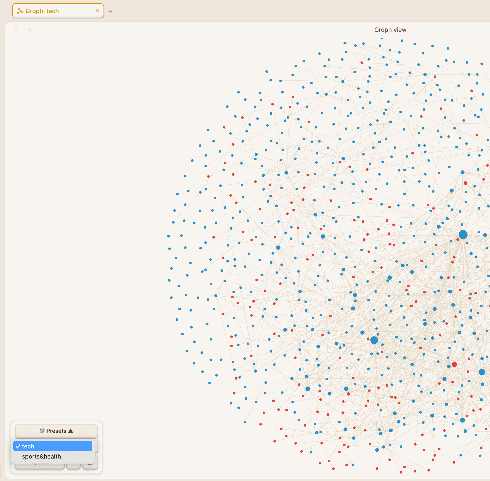

# Graph Presets

Save and switch named Graph View presets in [Obsidian](https://obsidian.md/) — filters, color groups, and node positions. Presets are stored in `data.json`, syncable via git across devices.

 

## Features

- 💾 **Save current graph state** as a named preset (filters, color groups, display settings, node positions)
- 🔄 **Switch presets** from a floating panel in the Graph View
- ➕ **Save As New** creates a copy without overwriting
- ✏️ **Rename & delete** presets from settings
- 🏷️ **Tab titles** show the active preset name (`Graph: My Preset`)
- 🔀 **Multi Graph View** — each tab tracks its own preset independently
- 📦 **Git-friendly** — presets live in `data.json`, commit and sync across machines

## Screenshot



## Installation

### Community Plugins (coming soon)

Once accepted to the Obsidian Community Plugin list, install via Settings → Community Plugins → Browse → "Graph Presets".

### Manual (BRAT)

1. Install [BRAT](https://github.com/TfTHacker/obsidian42-brat)
2. Add `Sphinxes0o0/graph-presets` as a beta plugin
3. Enable "Graph Presets" in Community Plugins

### Manual (direct)

```bash
cd YOUR_VAULT/.obsidian/plugins/
git clone https://github.com/Sphinxes0o0/graph-presets.git graph-presets
cd graph-presets && npm install && npm run build
```

Then enable "Graph Presets" in Settings → Community Plugins.

## Usage

1. Open the Graph View (`Cmd+G` / `Ctrl+G`)
2. Set up your filters, color groups, and display options
3. Click **📁 Presets** in the bottom-left corner
4. Click **Save** → enter a name → press Enter

| Button | What it does |
|--------|-------------|
| **Save** | Create a new preset (prompts for name) |
| **Update** | Overwrite the current preset (no prompt) |
| **+** | Save As New — always prompts for name |
| **🗑** | Delete the selected preset |

### Settings Tab

Settings → Community Plugins → Graph Presets → ⚙️

- Rename or delete presets
- The Graph View floating panel is where you activate presets

## How It Works

```
Save → dataEngine.getOptions() → { search, colorGroups, ... } → data.json
Load → dataEngine.setOptions(preset.options) + worker.postMessage(nodePositions)
```

## Contributing

```bash
git clone https://github.com/Sphinxes0o0/graph-presets.git
cd graph-presets && npm install && npm run dev
```

- `npm run dev` — watch mode, auto-rebuild on changes
- `npm run build` — production build

## License

MIT
